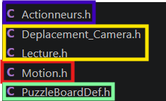
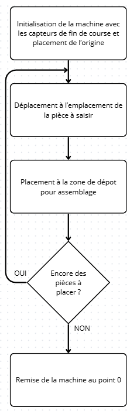
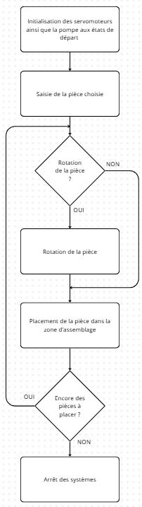
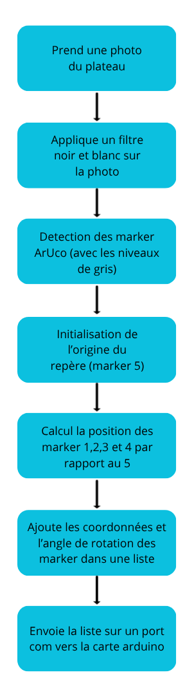

Programmation de la machine Puzzle Bot

# Gestion des actions de la machine principale (Programmation en C++)

## Plan du programme

Le programme est divisé en 5 types de fichier : 
* Programme principale (main.c) pour l'execution de toutes les instructions
* Gestion des mouvements de la machine (zone de déplacement,zone de placement des pièces) via motion.h
* Gestion de la saisie et du placement ainsi que la rotation des pièces par l'intermédiaire de actionneur.h
* Réception et traitement des données reçues par la caméra en utilisant Déplacement_Caméra.h et Lecture.h
* Définition des pins via PuzzleBoardDef.h

*Plan du programme*

## Déplacements

La partie lié au mouvement de la base mobile, gérée par l'intermédiaire de motion.h, permet le placement de la machine dans l'espace lors de l'initialisation, de la récupération des pièces et de l'emboitement du puzzle

*Algorigramme pour le déplacement de la machine*

## Saisie et dépot des pièces de puzzle

Cette section du programme permet la gestion des actionneurs de la machine (Servomoteurs et Pompe) afin de pouvoir saisir, déposer ainsi que tourner les pièces si nécessaire

*Algorigramme pour la saisie et le dépôt des pièces sur le plateau*

# Traitement d'image et détection de marker avec OpenCV (programmation python)

## Calcul de la matrice de distortion de la camera

Avant de pouvoir detecter les marker, il faut calibrer la caméra. Plusieur étapes sont nécessaire pour calculer la matrice de distortion afin de calibrer la caméra.

Il faut tout d'abord prendre plusieurs photos d'un damier avec la caméra (10 à 15 photos). les photos doivent être prises sous plusieurs angles différents.
Une fois les photos prises, il faut lancer un programme qui calcul, à partir des images prises, la caméra de distortion.

## Détection de Marker AruCo (Programme principale)
//Tvec et Rvec (rodrigues)

Ci-dessous un algorigramme simplifiant la compréhension du fonctionnement du programme

*Algorigramme du programme pour la detection de marker*