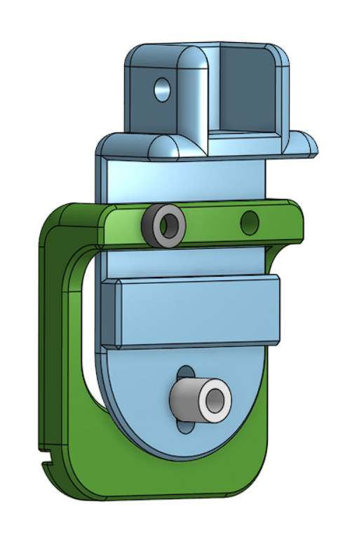
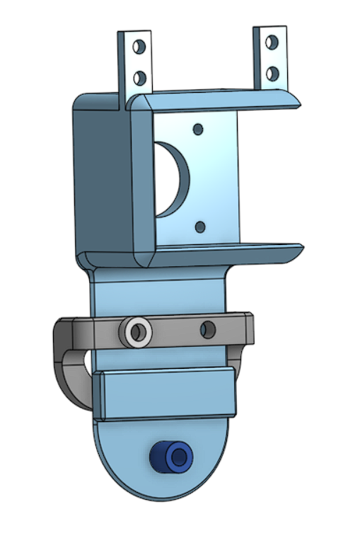
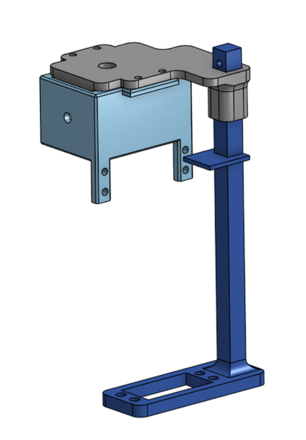
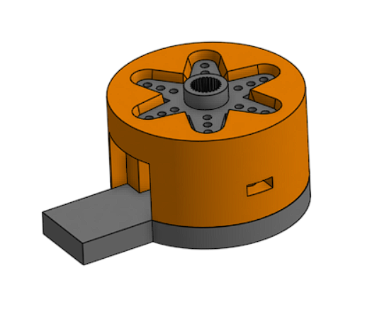
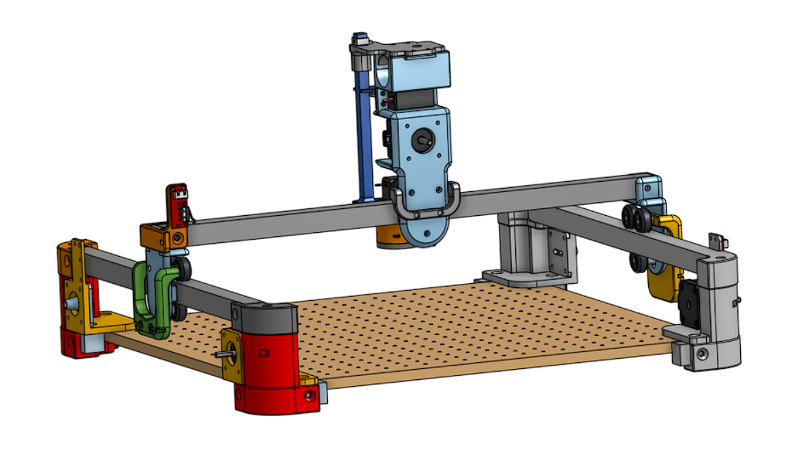

# Conception et assemblage

Cette section décrit les étapes du processus de fabrication : le prototypage, la conception et l'assemblage.

## Conception

Pour la conception, la réalisation de la modélisation 3D a été faite en suivant un principe d'axe. Chaque axe a été modélisé sur un même fichier de conception pour assurer le bon fonctionnement des pièces entre elles. De plus, afin de simplifier le changement de certaines pièces et d'accélérer l'impressions 3D des nouveaux prototypes beaucoup de pièces sont interchangeables et indépendantes les unes des autres.

### Axe X

Cet axe est celui du "bas". Il supporte toutes les autres pièces et nécessite d'être crée en double / en symétrie.

Sur cet axe on  trouve 5 pièces dont 3 possèdent une version en symétrie ou légerement différente :
* Wagon (2 avec symétrie)
* Maintien de courroie axe X (2 version selon le coté par lequel est maintenue la courroie)
* Blocage courroie axe Y (2 version dont une possédant une extension permettant de positionner un capteur de fin de course)
* Entretoise 4mm
* Entretoise 10mm

Modélisation Axe X

### Axe Y

Modélisation Axe Y

### Axe Z

Modélisation Axe Z

### Aze R

Modélisation Axe R

## Assemblage final

Un assemblage final du projet permet de vérifier le bon fonctionnement des axes avant de commencer l'impression des pièces et de commencer le prototypage.

Assemblage final
