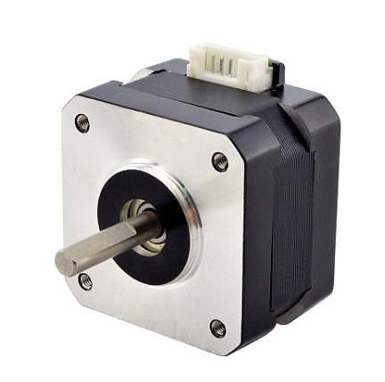

# Études et choix techniques

# Moteur pas à pas: 

Dans le cadre du projet Puzzle Bot, l’objectif de mon travail était d’optimiser le fonctionnement du moteur pas-à-pas fourni afin d’obtenir :

un déplacement plus fluide,
une réduction du bruit et des vibrations,
une meilleure précision de mouvement,
tout en surveillant la chauffe du système.

Le moteur et le driver utilisés dans le projet nous ont été fournis.
Le travail réalisé portait donc principalement sur :

la configuration,
les réglages,
les tests expérimentaux,
et l’optimisation du pilotage du moteur.

# Le driver A4988 permet :

de contrôler le sens de rotation,
d’envoyer les impulsions de déplacement,
de gérer le microstepping,
et de limiter le courant envoyé au moteur.

# Problématique observée

Lors des premiers essais  :

le moteur produisait beaucoup de bruit,
des vibrations apparaissaient,
les mouvements étaient moins fluides,
surtout à basse vitesse.

Ces phénomènes pouvaient :

réduire la précision du Puzzle Bot,
dégrader le confort d’utilisation,
et augmenter les contraintes mécaniques.

# Solution étudiée

Pour améliorer le comportement du moteur, j’ai travaillé sur la configuration du microstepping via les jumpers du driver A4988.

Le microstepping permet :

de diviser les pas moteur,
de lisser le déplacement,
de réduire les vibrations,
et d’obtenir une rotation plus progressive.

# Configuration retenue
Mode utilisé : 1/8 de pas
La configuration suivante a été testée puis retenue : MS1= "ON", MS2= "ON", MS3="OFF"

Résultats observés

Après configuration en 1/8 de pas :

# Améliorations constatées:

réduction importante du bruit,
diminution des vibrations,
mouvement plus fluide,
meilleure précision de déplacement,
comportement plus stable à faible vitesse.

