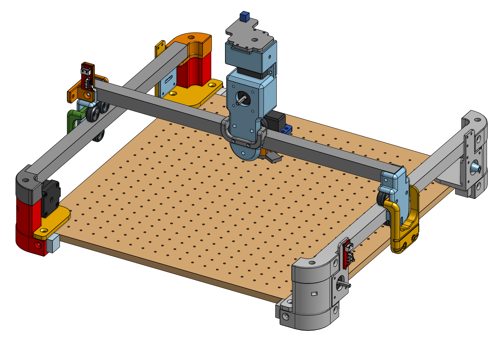
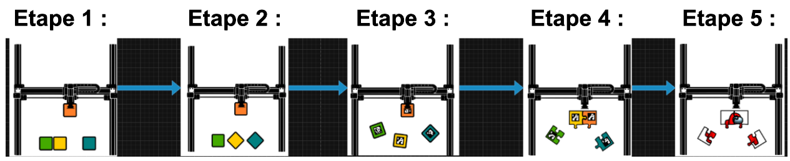

# Bienvenue sur notre documentation du groupe 07 - 2026

Bienvenue dans la documentation du projet puzzle bot du groupe 7. Ce site a pour but de fournir toutes les informations nécessaires pour comprendre, utiliser et reproduire efficacement notre projet.

[Notre projet sur Onshape](https://cad.onshape.com/documents/66ea5fd62d77254e0c6a39c1/w/c153dfe1b4d7dc7fbbaa91bb/e/18e017ca614e2eb985622d94){: .btn .btn-primary .fs-5 .mb-4 .mb-md-0 .mr-2 }
[Notre repo GitHub](https://github.com/Makerspace-Amiens-2025-26/Puzzle-Bot-Groupe07){: .btn .fs-5 .mb-4 .mb-md-0 }

## À propos du Projet

Décrivez ici en quelques lignes l'objectif et l'aperçu général de votre projet. Quel est son but ? À qui est-il destiné ? Quels problèmes cherche-t-il à résoudre ?

Ce projet à pour objectif la création d'une machine capable de résoudre un puzzle. Plusieurs thématiques sont abordées dans la réalisation de ce projet: la conception 3D de la machine; le choix du matériel électronique; et la programmation.
Ci-après les étapes du cahier des charges:

Le but pour la version final du robot est d'atteindre l'étape 4: avoir une machine qui résout un puzzle de pièces avec encoche possédant des markers (dans le meilleur des cas l'étape 5 où les marker sont remplacer par une image).

## Poster

## Vidéo

Ici vous publierez la vidéo de votre projet. 
- 1min30 au format vertical
- Présentation du projet 
- Des explication du fonctionnement du projet
- Des vues du projet / Prototype / Application etc... 
- Des plans du fonctionnement (même basique ou des éléments séparés)
- Une conclusion
- Si en stockage local : <50mo

<video src="images/intro_amiens.mp4" controls title="Title"  style="width: 100%;"></video>

---
